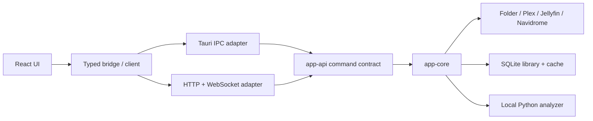

<p align="center">
  
</p>

<p align="center">
  Karaoke from any song in your music library, powered by neural networks.
</p>

<p align="center">
  <a href="https://github.com/rzru/nightingale/actions/workflows/release.yml"></a>
  <a href="https://hub.docker.com/r/razzaru/nightingale"></a>
  <a href="https://github.com/rzru/nightingale/stargazers"></a>
  <a href="LICENSE"></a>
  <a href="https://www.patreon.com/cw/nightingalekaraoke"></a>
  <a href="https://ko-fi.com/nightingalekaraoke"></a>
</p>

<p align="center">
  <a href="https://nightingale.cafe/">Website</a> ·
  <a href="https://github.com/rzru/nightingale/releases/latest">Downloads</a> ·
  <a href="https://nightingale.cafe/docs/">Documentation</a> ·
  <a href="CHANGELOG.md">Changelog</a> ·
  <a href="https://discord.gg/68Vgng9vYp">Discord</a>
</p>

---

Nightingale turns music you already have into karaoke. It can separate lead vocals, find or produce word-timed lyrics, and play tracks with synchronized highlighting, pitch scoring, key and tempo controls, multiplayer, and dynamic backgrounds. Use the native desktop app on Linux, macOS, or Windows, or run the same experience as a self-hosted web app.

## Highlights

- **Bring your library** — scan local audio, video, and UltraStar files, or connect Plex, Jellyfin, or Navidrome. Existing provider and folder playlists appear as read-only navigation.
- **Prepare tracks locally** — separate vocals with UVR Karaoke or Demucs, then use LRCLIB, local or pasted LRC, or automatic transcription and alignment for lyrics.
- **Sing your way** — follow synchronized lyrics, score microphone pitch, adjust key and tempo, mix guide vocals, monitor the microphone, and compensate for room latency.
- **Run a karaoke night** — build a playback queue, keep managing it during Session mode, switch profiles, compare scoreboards, or assign separate microphones to two to four local players.
- **Set the stage** — use source video, GPU shaders, Pixabay loops, or custom image, video, and shader backgrounds; reposition and scale lyrics and the pitch graph.
- **Use the screen you have** — desktop and self-hosted modes share the same karaoke core, with keyboard, gamepad, touch, and layouts ranging from phones to 4K displays.

Detailed behavior, supported media formats, controls, analyzer options, and current limitations live in the [user guide](https://nightingale.cafe/docs/).

## Get Nightingale

| Mode | Start here |
| --- | --- |
| Desktop | [Download the latest release](https://github.com/rzru/nightingale/releases/latest) |
| Self-hosted Linux | [Installation guide](https://nightingale.cafe/docs/self-hosted.html) |
| Docker | [CPU and CUDA images](https://nightingale.cafe/docs/docker.html) |

Desktop releases support Linux x86_64/aarch64, macOS Apple Silicon/Intel, and Windows x86_64. Self-hosted release binaries support Linux x86_64/aarch64.

First launch prepares an isolated copy of ffmpeg, Python, the analyzer packages, and required ML models. No system Python setup is needed, but the initial download is several gigabytes. GPU acceleration is optional; analysis falls back to CPU when CUDA or Apple Silicon acceleration is unavailable.

See [Getting Started](https://nightingale.cafe/docs/getting-started.html) for setup, platform-specific notes, updates, and adding music. For failures, check [Troubleshooting](https://nightingale.cafe/docs/troubleshooting.html).

## Documentation

- [Library sources](https://nightingale.cafe/docs/library-sources.html)
- [Lyrics and transcription](https://nightingale.cafe/docs/lyrics.html)
- [Controls](https://nightingale.cafe/docs/controls.html)
- [Scoring](https://nightingale.cafe/docs/scoring.html) and [multiplayer](https://nightingale.cafe/docs/multiplayer.html)
- [Backgrounds](https://nightingale.cafe/docs/backgrounds.html)
- [Self-hosted web mode](https://nightingale.cafe/docs/self-hosted.html) and [Docker](https://nightingale.cafe/docs/docker.html)
- [Building from source](https://nightingale.cafe/docs/building.html)

## Architecture

Desktop and self-hosted delivery share one Rust application core and one React frontend. Transport adapters stay thin so karaoke behavior does not diverge between Tauri and the web server.



The analyzer runs as a persistent local process over token-authenticated loopback IPC, avoiding model startup cost for every song. Analysis artifacts are cached by BLAKE3 source hash, so unchanged tracks reuse stems, transcripts, lyrics, and shifted playback variants.

### Repository layout

| Path | Responsibility |
| --- | --- |
| `app-core/` | Shared application behavior, source adapters, persistence, media serving, analyzer orchestration, and analyzer scripts |
| `app-api/` | Shared command contract, dispatch, state, events, and error classification |
| `client/src/` | React interface, feature modules, typed runtime bridge, playback, and microphone processing |
| `client/src-tauri/` | Tauri desktop adapter and native capabilities |
| `client/src-server/` | Axum HTTP/WebSocket adapter and embedded web bundle |
| `site/` | Astro website and mdBook user guide |
| `docker/`, `scripts/` | Container and bare-metal self-hosted distribution |

## Development

### Prerequisites

| Tool | Version |
| --- | --- |
| Rust | 1.94.1, pinned by `rust-toolchain.toml` |
| Node.js | 22.12 or newer |
| pnpm | 11.2.2 |

Platform build packages, including Windows ASIO and Linux WebKit requirements, are listed in the [building guide](https://nightingale.cafe/docs/building.html).

### Run the desktop app

```bash
git clone https://github.com/rzru/nightingale.git
cd nightingale
pnpm --dir client install --frozen-lockfile
cargo desktop dev
```

Create a production bundle for the current platform with:

```bash
cargo desktop build
```

Before submitting application changes, run the repository checks:

```bash
pnpm --dir client format
pnpm --dir client quality
```

Website and guide tooling runs separately from `site/`; use `pnpm --dir site build` to validate those changes.

## Contributing

Nightingale follows a discussion-first workflow. Before implementing a feature or behavior change, open a [GitHub Discussion](https://github.com/rzru/nightingale/discussions) and wait for it to be approved. Small documentation corrections and obvious bug fixes can go directly to a pull request. Read [CONTRIBUTING.md](CONTRIBUTING.md) before starting.

## Releasing

Tags matching `v*` trigger [the release workflow](.github/workflows/release.yml). It verifies the tag against the desktop manifests, extracts release notes from [CHANGELOG.md](CHANGELOG.md), and creates a draft containing desktop installers, updater artifacts, and self-hosted server archives. Smoke-test the draft artifacts, then publish the release through GitHub.

```bash
git tag v<version>
git push origin v<version>
```

The workflow and its helper scripts are the canonical source for artifact and signing details.

## Support the project

Nightingale is free, open source, and maintained in spare time. Support ongoing development through [Patreon](https://www.patreon.com/cw/nightingalekaraoke) or [Ko-fi](https://ko-fi.com/nightingalekaraoke).

## License

GPL-3.0-or-later — see [LICENSE](LICENSE).
